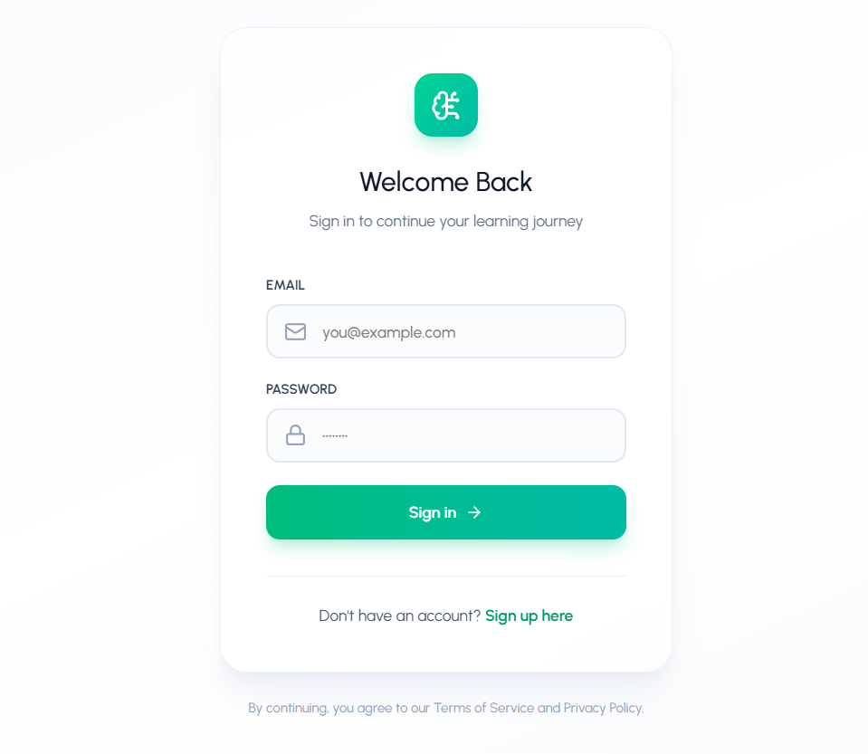
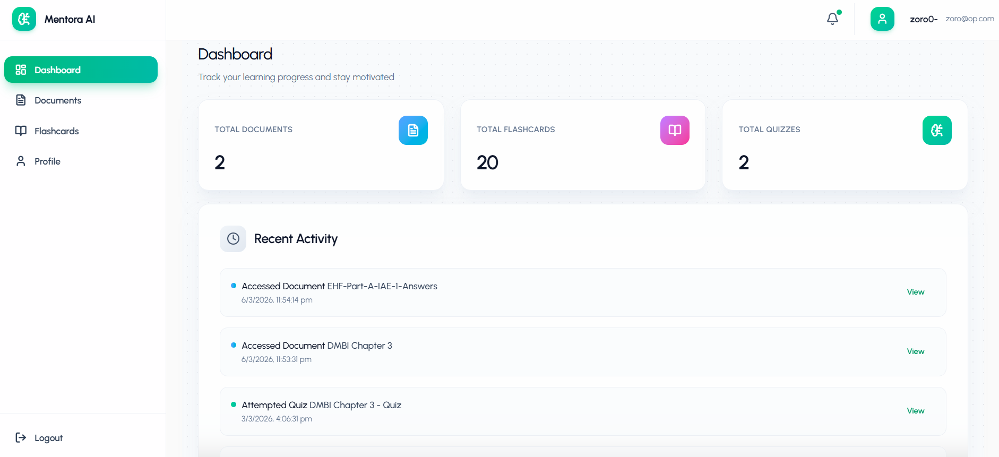
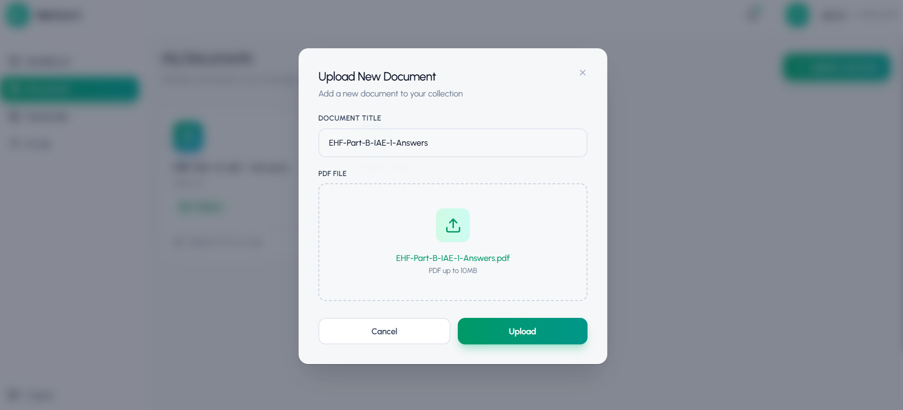
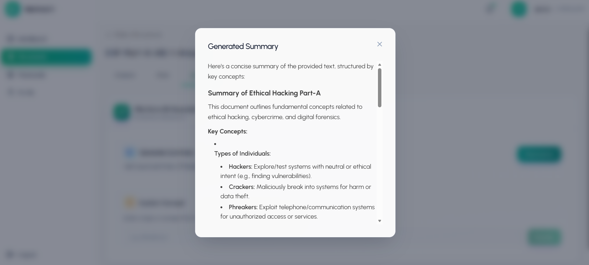
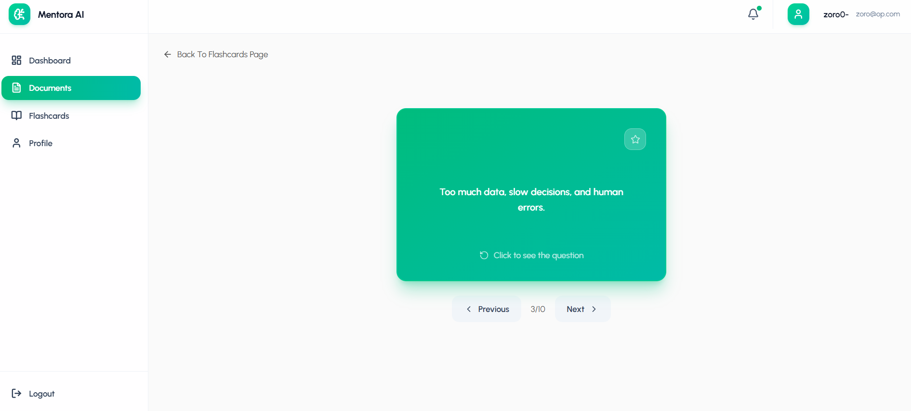
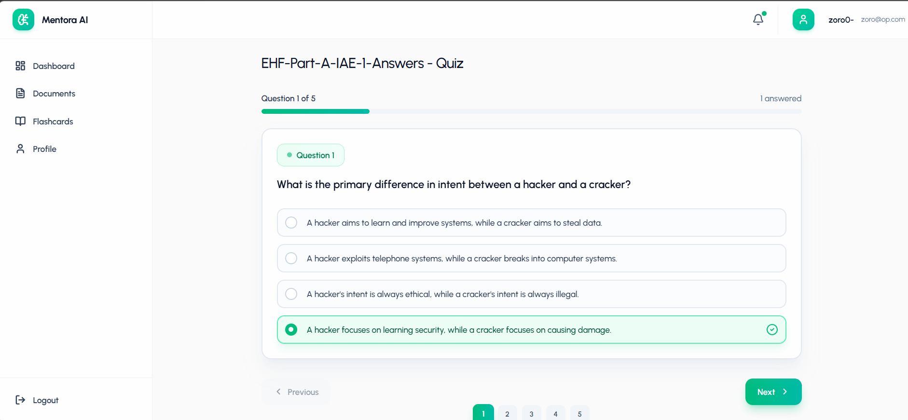
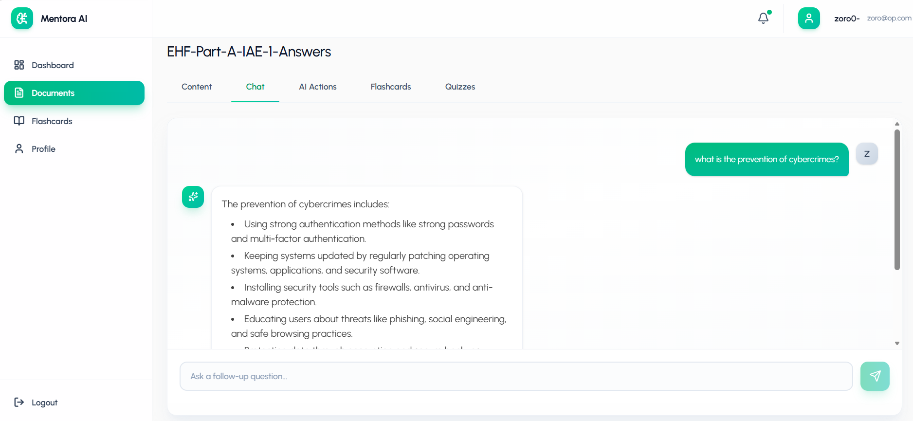

<div align="center">


# TLAi — AI Learning Assistant

**Learn from PDF documents and Excel question banks with flashcards, practice tests and an AI answer tutor.**


</div>

---

## 🧠 What is TLAi?

**TLAi** is an AI learning assistant for PDF documents and Excel question banks. Create flashcards, choose how many questions to practice, and discuss incorrect answers with a contextual tutor.

> Import your learning material → Practice at your own pace → Review answers with AI support.

---

## ✨ Key Features

### 🔐 Authentication
- Register & Login with JWT-based protected routes
- Profile fetch & update
- Change password securely

### 📄 Document Management
- Upload PDF files with ease
- PDF text extraction via `pdf-parse`
- Cloud storage powered by **Cloudinary**
- Local uploads served via `/uploads`

### Import flashcards from Excel
- Open **Flashcards → Import Excel**, select an `.xlsx` file and preview it before saving.
- Use columns **Câu hỏi** and **Đáp án** (or **Question** and **Answer**). An optional `STT` column and title rows above the header are supported; headers must appear in the first 20 rows.
- Imports preserve question/answer text and order, including answer labels such as `B.`. They create a standalone flashcard set without requiring a PDF, Gemini or Cloudinary.
- Limit: 5 MB and 5,000 data rows. Exact question/answer duplicates are skipped and counted. Missing values block the entire import and show the sheet and row to fix. Sheets without matching headers are listed in the preview and skipped.
- API: `POST /api/flashcards/import/preview`, `POST /api/flashcards/import` (multipart field `file`, plus `title` when saving), and `GET /api/flashcards/sets/:id`. All require authentication.
- Run import validation tests with `cd backend` then `npm test`.

### Import Excel documents and create quizzes
- Open **Documents → Import Excel** (or choose an `.xlsx` file in **Upload Document**). Preview the rows, then choose **Import & tạo trắc nghiệm**.
- Use the same `Câu hỏi` / `Đáp án` columns as flashcard imports. Questions and correct answers are preserved; Gemini generates three incorrect alternatives for each question. Answer labels such as `B.` are removed from generated quiz choices before shuffling, while the original answer remains visible in the document.
- Optional columns **A**, **B**, **C**, **D** supply the original four choices for an individual row. Fill all four or leave all four blank. Supplied choices keep their order and bypass AI. The answer must match one choice, optionally prefixed by its matching letter, or contain just that letter.
- Answers such as “Tất cả các đáp án trên” and letter-only answer keys require these original choices for quizzes. They do not block saving the document: all questions are imported, with a `needs_review` quiz status and the sheet/row to fix. No AI call or partial quiz is started until the source choices are supplied. Import the completed workbook to create its quiz.
- Limits: `.xlsx`, 5 MB, 5,000 rows, and 1 MiB of combined question/answer/choice text. Gemini uses `GEMINI_API_KEY`; optional `GEMINI_MODEL` defaults to `gemini-3.5-flash-lite` for every AI feature. Question and correct-answer text is sent to Gemini for rows without supplied choices. Cloudinary is not needed for Excel.
- Generation runs in batches in the background. Document details show progress, provider errors and **Thử lại**. Successful batches are saved so retry or server restart resumes the remaining questions. The quiz becomes available after every question is ready.
- Authenticated API: `POST /api/documents/import-excel/preview`, `POST /api/documents/import-excel` (`file`, `title` multipart fields), `POST /api/documents/:id/retry-quiz`, and existing document/quiz reads. Deleting the document deletes its related study data.

### Practice tests and answer tutor
- Open a question bank from **Documents → Chọn số câu & làm bài**, enter an integer between 1 and the bank size, then start. Entering 30 creates exactly 30 randomly sampled questions without repetition. The bank, option order and past results are preserved; each attempt is stored separately.
- Submit to see the score, correct/wrong answers and skipped questions. Use **Hỏi chatbot** on a question to discuss it in the adjacent panel (below the review on narrow screens). Each question has its own conversation; the most recent 200 messages per attempt are retained.
- The tutor uses the stored question, options, correct answer and submitted choice. Only pressing **Gửi câu hỏi** sends that context and relevant history to Gemini. Question sampling and grading run locally. The tutor opens after submission.
- API: `POST /api/quizzes/:id/attempts` with `{ "numQuestions": 30 }`; `GET /api/quizzes/:id/chat?questionIndex=0`; `POST /api/quizzes/:id/chat` with `{ "questionIndex": 0, "message": "Why is my answer wrong?" }`. All routes require ownership; indices are zero-based.

### 🤖 AI Learning Tools *(powered by Google Gemini)*
- 📝 **Summaries** — Concise overviews of your document
- 🃏 **Flashcards** — Q&A pairs with difficulty ratings
- 🧪 **Quizzes** — MCQs with 4 options, correct answer & explanation
- 💬 **Chat** — Context-aware conversation grounded in your document

### 📊 Progress Tracking
- Track your learning journey over time via `/api/progress`

---

## 🖼️ Screenshots

### 🔑 Login


---

### 📊 Dashboard


---

### 📤 Upload PDF


---

### 📝 Summary


---

### 🃏 Flashcards


---

### 🧪 Quiz


---

### 💬 Chat with Document


---

## 🛠️ Tech Stack

### 🎨 Frontend
| Technology | Purpose |
|---|---|
| ⚛️ React 19 | UI framework |
| ⚡ Vite | Build tool & dev server |
| 🎨 Tailwind CSS v4 | Styling |
| 🔀 React Router | Client-side routing |
| 📡 Axios | HTTP requests |
| 📄 React Markdown + GFM | Rendering AI output |
| 🔷 Lucide React | Icons |

### ⚙️ Backend
| Technology | Purpose |
|---|---|
| 🟢 Node.js (ESM) | Runtime |
| 🚂 Express 5 | Web framework |
| 🍃 MongoDB + Mongoose | Database & ODM |
| 🔐 JWT | Authentication |
| 🔑 bcryptjs | Password hashing |
| ✅ express-validator | Input validation |
| 📤 multer | File uploads |
| 📑 pdf-parse | PDF text extraction |
| ☁️ Cloudinary | PDF cloud storage |
| 🤖 Google Gemini | AI generation |

---

## 📁 Project Structure

```
TLAi/
├── backend/
│   ├── config/
│   ├── controllers/
│   ├── middleware/
│   ├── models/
│   ├── routes/
│   ├── utils/
│   └── server.js
└── frontend/
    └── quizai/
        ├── src/
        └── public/
```

---

## 🚀 Installation & Setup

Deploy online using [the Render + Vercel guide](docs/DEPLOYMENT.md). The repository includes a Render Blueprint and Vercel SPA routing configuration.

### 📋 Prerequisites

Before you begin, make sure you have:

- ✅ **Node.js** (latest LTS recommended)
- ✅ **npm**
- ✅ **MongoDB** (local instance or [MongoDB Atlas](https://www.mongodb.com/atlas))
- ✅ **Cloudinary account** — for PDF storage
- ✅ **Gemini API key** — from [Google AI Studio](https://aistudio.google.com/)

---

### 1️⃣ Clone the Repository

```bash
git clone https://github.com/ngodaclam/QuizAi.git TLAi
cd TLAi
```

---

### 2️⃣ Backend Setup

**Install dependencies:**
```bash
cd backend
npm install
```

**Create your `.env` file** inside `backend/` *(never commit this!)*:
```env
# 🌐 Server
PORT=8000
NODE_ENV=development

# 🍃 Database
MONGODB_URI=<YOUR_MONGODB_CONNECTION_STRING>

# 🔐 Auth
JWT_SECRET=<A_LONG_RANDOM_SECRET>
JWT_EXPIRE=7d

# 🤖 Google Gemini
GEMINI_API_KEY=<YOUR_GEMINI_API_KEY>
GEMINI_MODEL=gemini-3.5-flash-lite

# ☁️ Cloudinary
CLOUDINARY_CLOUD_NAME=<YOUR_CLOUDINARY_CLOUD_NAME>
CLOUDINARY_API_KEY=<YOUR_CLOUDINARY_API_KEY>
CLOUDINARY_API_SECRET=<YOUR_CLOUDINARY_API_SECRET>
```

**Start the backend:**
```bash
npm run dev
```
> 🟢 Backend runs at: `http://localhost:8000`

---

### 3️⃣ Frontend Setup

**Install dependencies:**
```bash
cd frontend/quizai
npm install
```

**Start the frontend:**
```bash
npm run dev
```
> 🔵 Frontend runs at: `http://localhost:5173`

---

## 🔌 API Endpoints

| Area | Base Path |
|---|---|
| 🔐 Auth | `/api/auth/*` |
| 📄 Documents | `/api/documents/*` |
| 🃏 Flashcards | `/api/flashcards/*` |
| 🤖 AI Tools | `/api/ai/*` |
| 🧪 Quizzes | `/api/quizzes/*` |
| 📊 Progress | `/api/progress/*` |
| ❤️ Health Check | `GET /health` |

---

## ⚙️ Configuration Notes

> 🔓 **CORS**: Backend currently allows all origins (`"*"`). For production, restrict this to your deployed frontend URL.

> 📂 **Uploads**: Backend serves local static files at `GET /uploads/...`.

> 🔗 **API prefix**: All backend routes are prefixed with `/api`.

---

## 🔮 Future Scope

- 👥 **Role-based access (RBAC)** — admin/moderator roles
- 🛡️ **Security hardening** — rate limiting, helmet, input sanitization
- 📈 **User analytics dashboard** — streaks, mastery, time spent
- 📦 **Export options** — Anki decks, PDF summaries
- 🐳 **CI/CD + Docker** — automated deployments
- 🧪 **Tests** — unit, integration & API contract tests

---

## 🤝 Contributing

Contributions are welcome! Here's how:

1. 🍴 **Fork** the repository
2. 🌿 **Create** a feature branch: `git checkout -b feature/your-feature-name`
3. 💾 **Commit** your changes with clear messages
4. 📬 **Open a PR** describing what changed and why

---

## 📜 License

Add your license here (e.g., MIT) and include a `LICENSE` file at the repo root.

---

<div align="center">

Made with 🤖 to make studying less painful.

</div>
